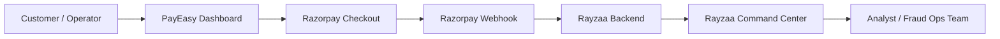
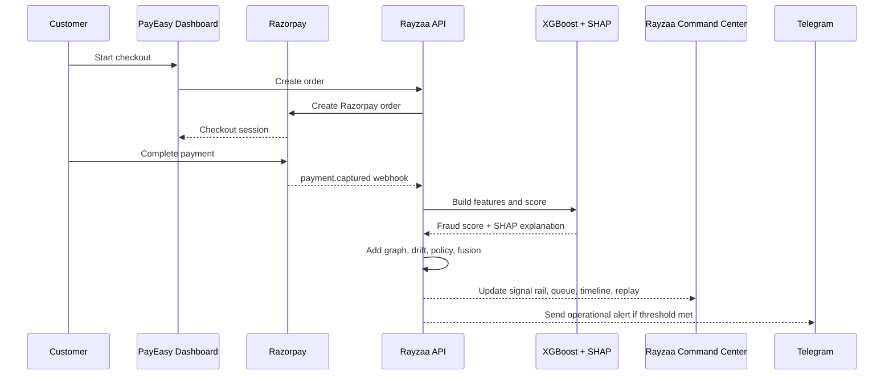
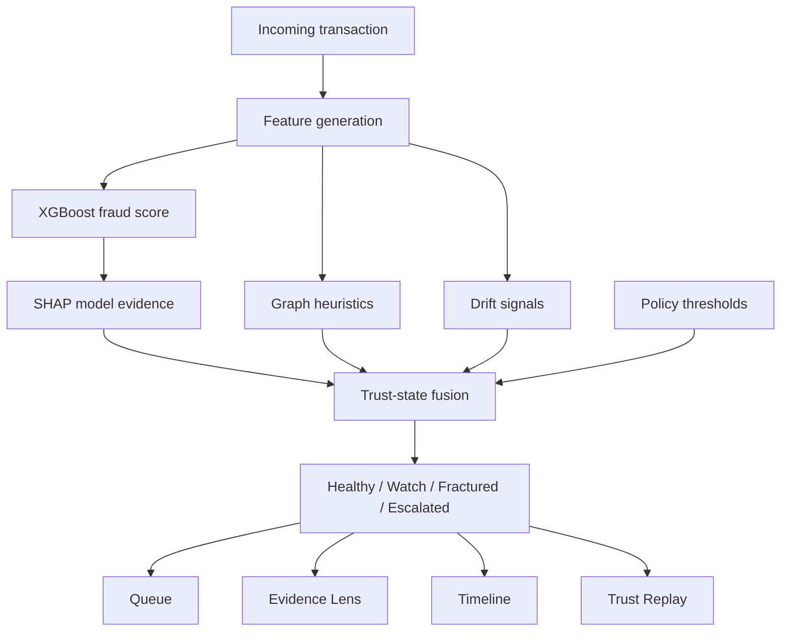
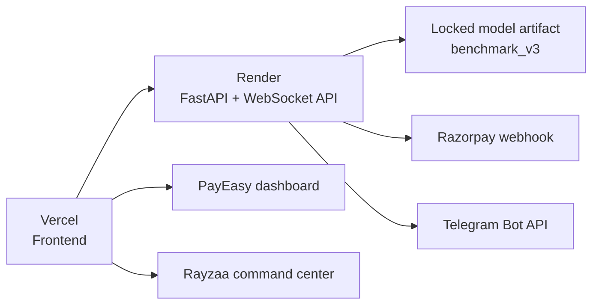

# Rayzaa

Rayzaa is a real-time fraud operations product built around one idea:

**a customer payment should turn into an explainable analyst investigation flow within seconds.**

The product is intentionally split into two dashboards:

- **PayEasy**: the customer-facing checkout surface that proves a real payment happened
- **Rayzaa Command Center**: the analyst-facing trust operations console that explains what happened, why it matters, and what to do next

## What Rayzaa Does

Rayzaa connects a live payment flow to an operational risk workflow:

1. a payment is initiated through **PayEasy**
2. Razorpay confirms the payment and sends a webhook
3. Rayzaa ingests the transaction and builds features
4. the fraud model scores the event
5. graph, drift, and policy layers add operational context
6. the system assigns a trust state
7. analysts see the case in a queue with evidence, timeline, and replay

This makes the product more than a model demo. It becomes a believable **payment-to-investigation workflow**.

## Product Surfaces

### 1. PayEasy

PayEasy is the customer-facing dashboard.

It is used to:

- launch Razorpay checkout
- show demo profile selection
- show latest live payment proof
- show operational handoff into Rayzaa

### 2. Rayzaa Command Center

Rayzaa is the analyst-facing dashboard.

It is used to:

- monitor the Signal Rail
- inspect typed evidence
- watch trust-state progression
- triage the queue
- review case chronology
- inspect graph relationships
- replay the case investigation path

## Why Two Dashboards



PayEasy answers:

- "Did a real payment happen?"
- "Which payment should we investigate?"

Rayzaa answers:

- "Was this payment risky?"
- "Why did the trust state change?"
- "What should the analyst do next?"

## End-to-End Transaction Flow



## Trust Decision Flow



## Current ML Stack

Rayzaa's deployed MVP uses:

- **XGBoost** as the primary fraud scorer
- **SHAP** for model explainability
- **graph heuristics** for relationship pressure
- **drift scoring** for behavioral change
- **policy fusion** for trust-state progression

The current runtime does **not** deploy a neural network as the primary scorer. This is intentional for MVP explainability, latency, and operational credibility.

## Model Scorecard

These are **offline benchmark metrics** for the locked `benchmark_v3` artifact.

| Metric | Value |
| --- | ---: |
| Model | XGBoost |
| Artifact | benchmark_v3 |
| Dataset | IBM AML |
| ROC AUC | 0.9445 |
| PR AUC | 0.8436 |
| Precision @ 0.5 | 0.7204 |
| Recall @ 0.5 | 0.7901 |
| F1 @ 0.5 | 0.7536 |

> These metrics do not change from one live payment. A live payment proves the model is being used operationally; the scorecard validates that locked model artifact offline.

## Analyst View: What Changes In Real Time

When a real payment enters Rayzaa through the webhook path, the following update in real time:

- Signal Rail
- trust state
- fused score
- typed evidence groups
- queue position
- case timeline
- replay checkpoints
- Telegram alert state

## Dashboard Walkthrough

### PayEasy Surface

- choose a demo profile
- launch Razorpay checkout
- confirm live proof entered the system
- hand off to Rayzaa

### Rayzaa Surface

- open the live case
- inspect Evidence Lens
- review queue posture
- inspect graph context
- open replay chronology

## Deployment Topology



## Repository Structure

```text
Rayzaa/
  apps/
    api/                      FastAPI service, scoring, webhook ingest, replay orchestration
    web/                      Next.js dashboards for PayEasy and Rayzaa
  deploy/
    artifacts/fraud_model/    Locked benchmark model bundle
  docs/
    architecture.md
    demo-flow.md
    final-demo-runbook.md
    live-integrations.md
    render-backend.md
    vercel-frontend.md
  scripts/
    start_demo.ps1
    start_dev.ps1
    run_benchmark.ps1
    check_frontend_build.ps1
```

## Demo Flow

The recommended demo order is:

1. seed benign baseline
2. initiate one payment from PayEasy
3. wait for webhook ingest
4. open Rayzaa
5. show trust-state transition
6. show Evidence Lens
7. show queue / timeline / graph
8. show Telegram alert
9. open replay

## Local Development

Use the authoritative workspace:

- `C:\Projects\Rayzaa`

Do not use the OneDrive mirror as the build or runtime workspace.

Key scripts:

- `scripts\start_demo.ps1`
- `scripts\start_dev.ps1`
- `scripts\run_benchmark.ps1`
- `scripts\check_frontend_build.ps1`

## More Documentation

- [Architecture](./docs/architecture.md)
- [Demo Flow](./docs/demo-flow.md)
- [Final Demo Runbook](./docs/final-demo-runbook.md)
- [Live Integrations](./docs/live-integrations.md)
- [Render Backend](./docs/render-backend.md)
- [Vercel Frontend](./docs/vercel-frontend.md)
