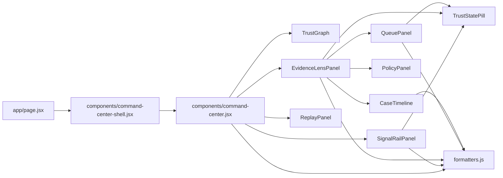

# Rayzaa Frontend Architecture

PR0 converts the command center from a single large rendering component into a container plus isolated presentational surfaces.

## Goals

- reduce merge conflicts
- preserve backend contract truthfulness
- enable parallel contributor work
- keep replay and live ingestion on the same frontend semantics

## Current Component Map

## Ownership Model

- `command-center.jsx`
  - state container only
  - owns fetches, websocket lifecycle, derived state, and handlers
- `SignalRailPanel`
  - owns rendering of signal cards and empty state
- `TrustGraph`
  - owns graph rendering and graph-specific interaction logic
- `EvidenceLensPanel`
  - owns evidence/policy/queue tab shell
- `QueuePanel`
  - owns queue rendering only
- `PolicyPanel`
  - owns policy control rendering only
- `CaseTimeline`
  - owns timeline rendering only
- `ReplayPanel`
  - owns replay controls, scenario cards, and replay slider UI
- `formatters.js`
  - shared display-only utilities
- `trust-state-pill.jsx`
  - shared badge rendering only

## Data Flow

`command-center.jsx` is the only frontend component that should:

- fetch `/api/state`
- fetch `/api/cases/{caseId}`
- post `/api/scenarios/{scenarioId}/start`
- post `/api/cases/{caseId}/actions`
- post `/api/policy`
- open `ws://.../ws/live`

All extracted components receive already-derived props and callbacks.

## Replay And Live Interaction Rules

- replay and live events are two inputs into one command center state
- replay data must never be visualized as a separate fake subsystem
- live case selection must remain stable during replay
- replay slider changes presentation only; it does not mutate backend state
- live websocket updates may update the selected case only when the selected case matches the incoming focus case

## WebSocket Update Flow

1. `command-center.jsx` opens the live socket
2. backend sends `state` envelopes
3. container updates `state`
4. container merges `policyDraft`
5. if the currently selected case matches the new focus case, selected-case data is refreshed
6. presentational surfaces rerender from derived props only

## Safe Frontend Boundaries

Frontend can:

- regroup evidence visually
- improve scanning and hierarchy
- improve animation timing
- improve empty/loading/error states
- improve responsive behavior

Frontend cannot:

- rename payload fields
- reinterpret trust-state semantics
- invent evidence or policy hits
- compute alternate fraud decisions
- bypass backend state with optimistic fake intelligence

## Next PR Targets

- Evidence Lens Phase C source separation
- Queue readability refinement
- Case timeline UX polish
- Replay control polish
- Trust-state visual language unification
